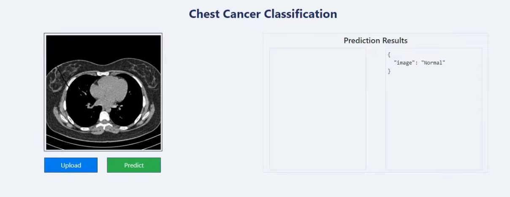
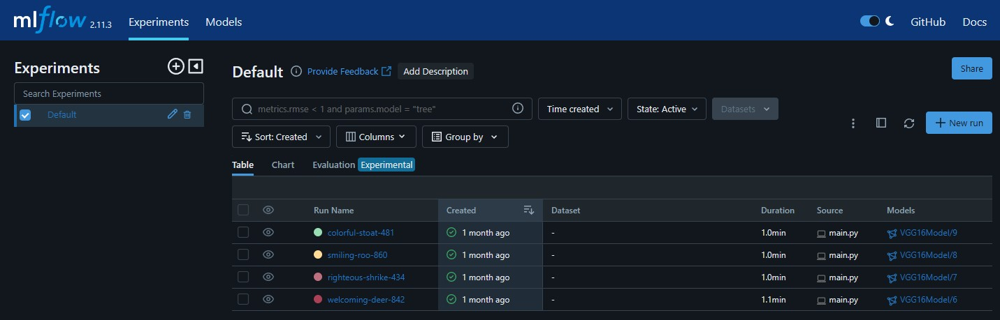
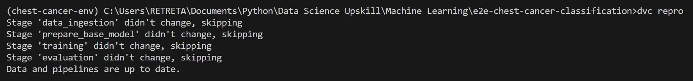

# End-to-End Chest Cancer Classification ML Project

A deep learning-based machine learning project designed to diagnose cancerous conditions from chest xray images.

<p align="center">
  
  <br>
  <em>Chest Cancer Classification Web App User Interface</em>
</p>

## Endpoints
- **GET `/`** - home page
- **GET, POST `/train`**- inititates the training pipeline
- **POST `/predict`** - triggers the prediction process
## TRAINING PIPELINE
### 1. Data Ingestion
- Downloaded image dataset from  https://drive.google.com/file/d/1z0mreUtRmR-P-magILsDR3T7M6IkGXtY/view?usp=sharing
### 2. Base Model Preparation
- Used `VGG16` as base pre-trained convolutional neural network model
- Freezed the convolutional layers of the model to only allow the fully-connected layers (vanilla neural network) for training
### 3. Model Training
- Used `SKLearn ImageDataGenerator`to  setup the data generator for the training and validation data, with an optional augmentation based on the provided configuration

### 4. Model Evaluation
- Selected `loss` and `accuracy` scores as evaluation metrics
- Integrated `MLFlow`to enable convenient experiment tracking with its UI functionalities


## MLFlow Setup
MLFlow Doumentation: https://mlflow.org/docs/latest/index.html

<p align="center">
  
  <br>
  <em>MLFlow User Interface</em>
</p>


1. Create a `Dagshub` account to host the MLFlow application: https://dagshub.com/
2. After signing up, connect your Github repository of the project.
3. Create environment variables to connect the MLFlow server with your code using credentials. You can use `.env` file and and load it with `python-dotenv` library in your code or simply input these commands in your terminal:
```
# FOR WINDOWS
set MLFLOW_TRACKING_URI=<your-tracking-URI-found-in-Dagshub>
set MLFLOW_TRACKING_USERNAME=<your-tracking-username-found-in-Dagshub>
set MLFLOW_TRACKING_PASSWORD=<your-tracking-password-found-in-Dagshub>

# FOR LINUX, replace 'set' with 'export'
```

## Training Pipeline Tracking using Data Version Control (DVC)
DVC Documentation: https://dvc.org/doc

To save execution time in experimentation, pipeline tracking is implemented. DVC tracks the output of each pipeline stage and skips it if the output of each stage already exists. Dependencies and outpus are mentioned in the `dvc.yaml` file.

To run the the training pipeline with pipeline tracking:
```
dvc repro
```

For instance, your dataset has already been downloaded, your base model has already been created, and no changes have been made in youy hyperparameters, all pipeline stages will be skipped since DVC tracked that there is no input change.


<p align="center">
  
  <br>
  <em>Sample DVC Run</em>
</p>


## Continuous Integration & Continuous Deployment (CICD)
### 1. Configure AWS Access
- Login to your `AWS Console` and create a `User` with access to the following:
```
a. AWS EC2 - Attach AmazonEC2FullAccess policy
b. AWS ECR - Attach AmazonEC2ContainerRegistryFullAccess policy
```
### 2. Create Docker File
Use the commands below to create the `Dockerfile` file
```
FROM python:3.8-slim-buster

RUN apt update -y && apt install awscli -y
WORKDIR /app

COPY . /app
RUN pip install -r requirements.txt

CMD ["python3", "app.py"]
```
These commands will be installed in the `AWS EC2` instance that will be created later.

### 3. Create ECR repository to store the Docker image
- Save the URI of the repository. This looks like:
```
521740697242.dkr.ecr.us-east-1.amazonaws.com/e2e-chest-cancer-classif
```
### 4. Provision an EC2 instance
- Choose `Ubuntu` as its operating system
- Select `t2.large` as the instance type
### 5. Install Docker in EC2 instance
- Input these commands in sequential order to install Docker in your EC2 machine
```
# OPTIONAL

sudo apt-get update -y

sudo apt-get upgrade

# REQUIRED

curl -fsSL https://get.docker.com -o get-docker.sh

sudo sh get-docker.sh

sudo usermod -aG docker ubuntu

newgrp docker
```

### 6. Prepare Github Workflow YAML file
### 7. Set EC2 instance as self-hosted runner in Github
 - In your Github project repository, go to `Settings` > `Actions` > `Runners` and click `New self-hosetd runner` button.
 - Follow the instructions indicated in the page

 ### 8. Setup Github Secrets 
 - Populate Github Secrets with the following keys
```
AWS_ACCESS_KEY_ID = <aws-access-key-id>

AWS_SECRET_ACCESS_KEY = <aws-secret-access-key>

AWS_REGION = <region>

AWS_ECR_LOGIN_URI = <ecr-repo-uri>

ECR_REPOSITORY_NAME = <ecr-repo-name>
 ```


**********************************************
## Coding Sequence
1. Update config.yaml
3. Update params.yaml
4. Update the entity
5. Update the config manager in src config
6. Update the components
7. Update the pipeline
8. Update the main.py
9. Update the dvc.yaml

